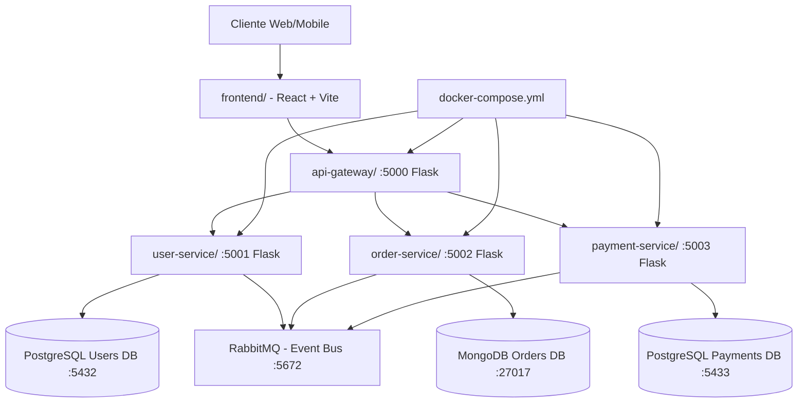

<div align="center">

# 🏗️ Arquitectura de Microservicios - Sistema de Gestión de Pedidos

## Autor
**Alejandro De Mendoza**

</div>

---

Ingeniero Informático - Especialista en Inteligencia Artificial  
alejandro.mendoza.techengineer@gmail.com  
+57 311 2687118  
Bogotá, Colombia

---

## Descripción del Proyecto

Sistema de gestión de pedidos en línea basado en arquitectura de microservicios, desarrollado como solución a la migración de una aplicación monolítica. El proyecto implementa mejoras en:

- **Disponibilidad**: Health checks y monitoreo en cada servicio
- **Escalabilidad**: Contenedores independientes y bases de datos especializadas
- **Facilidad de modificación**: Separación de responsabilidades (SOC)
- **Tolerancia a fallos**: Desacoplamiento y comunicación asíncrona

### Componentes Principales:

- **Frontend**: React + Vite (Login y Dashboard)
- **Backend**: Python/Flask (Microservicios)
- **Infraestructura**: Docker + Docker Compose
- **Comunicación**: REST APIs + RabbitMQ

---

## Arquitectura



## Bases de Datos

### Estrategia: Database per Service Pattern

| Servicio | Motor | Puerto | Justificación Técnica |
|----------|-------|--------|----------------------|
| **User Service** | **PostgreSQL 15** | 5432 | • **ACID necesario**: Transacciones atómicas para usuarios<br>• **Datos estructurados**: Esquema relacional claro<br>• **Integridad referencial**: Foreign keys para relaciones<br>• **Consultas complejas**: JOINs para reportes<br>• **Seguridad**: Control de acceso a nivel de fila |
| **Order Service** | **MongoDB 7** | 27017 | • **Esquema flexible**: Pedidos con estructuras variables<br>• **Documentos embebidos**: Items como subdocumentos<br>• **Alto volumen**: Muchas escrituras de estado<br>• **Escalabilidad horizontal**: Sharding nativo<br>• **Performance**: Sin JOINs complejos |
| **Payment Service** | **PostgreSQL 15** | 5433 | • **ACID crítico**: Consistencia absoluta en finanzas<br>• **Atomicidad**: Débito/crédito deben ser atómicos<br>• **Auditoría**: Logs de transacciones inmutables<br>• **Compliance**: Requisitos regulatorios (PCI-DSS)<br>• **Reporting**: Análisis financiero con SQL |

### Infraestructura Adicional:

| Componente | Tecnología | Puerto(s) | Propósito |
|------------|------------|-----------|-----------|
| **Message Broker** | RabbitMQ 3 | 5672 (AMQP)<br>15672 (Management) | • Comunicación asíncrona<br>• Garantía de entrega<br>• Event-driven architecture<br>• Desacoplamiento temporal |

---

## Instalación y Ejecución

### Prerrequisitos:

#### Software Requerido:
```bash
* Docker Desktop instalado y corriendo
* Docker Compose (incluido en Docker Desktop)
* Git
* VS Code (opcional pero recomendado)
```

#### Verificar instalación:
```bash
docker --version
docker-compose --version
git --version
```

### Pasos de Instalación:

#### 1. **Clonar el repositorio:**

```bash
# Clonar proyecto
git clone <tu-repo-url>
cd microservices-ecommerce

# Verificar estructura
ls -la
```

#### 2. **Levantar todos los servicios:**

```bash
# Construcción y arranque de todos los contenedores
docker-compose up --build

# Modo detached (segundo plano)
docker-compose up -d --build
```

**Tiempo estimado**: 2-3 minutos en primera ejecución

#### 3. **Verificar que todo funciona:**

```bash
# Health checks de cada servicio
curl http://localhost:5000/health  # API Gateway 
curl http://localhost:5001/health  # User Service 
curl http://localhost:5002/health  # Order Service 
curl http://localhost:5003/health  # Payment Service 
```

**Respuesta esperada:**
```json
{
  "status": "healthy",
  "service": "api-gateway",
  "timestamp": "2026-01-16T10:30:00.000Z"
}
```

#### 4. **Verificar contenedores activos:**

```bash
docker ps

# Deberías ver 8 contenedores corriendo:
# - api-gateway
# - user-service
# - order-service
# - payment-service
# - postgres-users
# - postgres-payments
# - mongodb
# - rabbitmq
```

---

## Pruebas de APIs

### User Service - Gestión de Usuarios

#### Crear usuario:
```bash
curl -X POST http://localhost:5000/api/users \
  -H "Content-Type: application/json" \
  -d '{
    "name": "Alejandro De Mendoza",
    "email": "alejandro.mendoza@example.com"
  }'
```

**Respuesta:**
```json
{
  "success": true,
  "message": "User created successfully",
  "user": {
    "id": 1,
    "name": "Alejandro De Mendoza",
    "email": "alejandro.mendoza@example.com",
    "status": "active",
    "created_at": "2026-01-16T10:30:00"
  }
}
```

#### Obtener todos los usuarios:
```bash
curl http://localhost:5000/api/users
```

#### Status del servicio:
```bash
curl http://localhost:5001/status
```

### Order Service - Gestión de Pedidos

#### Crear pedido:
```bash
curl -X POST http://localhost:5000/api/orders \
  -H "Content-Type: application/json" \
  -d '{
    "user_id": 1,
    "items": [
      {
        "product": "Laptop Dell Inspiron",
        "quantity": 1,
        "price": 3500000
      },
      {
        "product": "Mouse Logitech",
        "quantity": 2,
        "price": 80000
      }
    ],
    "total": 3660000
  }'
```

**Respuesta:**
```json
{
  "success": true,
  "message": "Order created successfully",
  "order": {
    "_id": "65a1b2c3d4e5f6g7h8i9j0k1",
    "user_id": 1,
    "items": [...],
    "total": 3660000,
    "status": "pending",
    "created_at": "2026-01-16T10:35:00"
  }
}
```

#### Obtener todos los pedidos:
```bash
curl http://localhost:5000/api/orders
```

#### Actualizar estado de pedido:
```bash
curl -X PUT http://localhost:5002/orders/<order_id>/status \
  -H "Content-Type: application/json" \
  -d '{"status": "paid"}'
```

#### Status del servicio:
```bash
curl http://localhost:5002/status
```
### Payment Service - Gestión de Pagos

#### Crear pago:
```bash
curl -X POST http://localhost:5000/api/payments \
  -H "Content-Type: application/json" \
  -d '{
    "order_id": 1,
    "user_id": 1,
    "amount": 3660000,
    "payment_method": "credit_card",
    "transaction_id": "TXN-ABC-123456"
  }'
```

**Respuesta:**
```json
{
  "success": true,
  "message": "Payment created successfully",
  "payment": {
    "id": 1,
    "order_id": 1,
    "user_id": 1,
    "amount": 3660000.00,
    "currency": "COP",
    "status": "pending",
    "payment_method": "credit_card",
    "transaction_id": "TXN-ABC-123456",
    "created_at": "2026-01-16T10:40:00"
  }
}
```

#### Obtener todos los pagos:
```bash
curl http://localhost:5000/api/payments
```

#### Actualizar estado de pago:
```bash
curl -X PUT http://localhost:5003/payments/<payment_id>/status \
  -H "Content-Type: application/json" \
  -d '{"status": "completed"}'
```

#### Status del servicio:
```bash
curl http://localhost:5003/status
```

## Monitoreo y Acceso a Datos

### Acceso a Bases de Datos:

#### PostgreSQL - User Service (Puerto 5432):
```bash
# Conectar a la base de datos
docker exec -it postgres-users psql -U postgres -d userdb

# Comandos útiles dentro de PostgreSQL:
\dt                    # Listar tablas
\d users              # Describir estructura de tabla users
SELECT * FROM users;  # Consultar todos los usuarios
\q                    # Salir
```

#### PostgreSQL - Payment Service (Puerto 5433):
```bash
# Conectar a la base de datos
docker exec -it postgres-payments psql -U postgres -d paymentdb

# Consultas útiles:
SELECT * FROM payments;
SELECT COUNT(*), SUM(amount) FROM payments WHERE status = 'completed';
\q
```

#### MongoDB - Order Service (Puerto 27017):
```bash
# Conectar a MongoDB
docker exec -it mongodb mongosh

# Comandos útiles:
use orderdb                    # Cambiar a base de datos
db.orders.find().pretty()      # Ver todos los pedidos
db.orders.countDocuments()     # Contar pedidos
db.orders.find({status: "pending"})  # Filtrar por estado
exit
```

#### RabbitMQ Management UI:
```
URL: http://localhost:15672
Usuario: guest
Password: guest

Funciones disponibles:
• Ver colas de mensajes
• Monitorear exchanges
• Ver mensajes en tránsito
• Estadísticas de consumo
```

### Ver Logs en Tiempo Real:

```bash
# Logs de todos los servicios
docker-compose logs -f

# Logs de un servicio específico
docker-compose logs -f api-gateway
docker-compose logs -f user-service
docker-compose logs -f order-service
docker-compose logs -f payment-service

# Ver últimas 100 líneas
docker-compose logs --tail=100 user-service
```

### Verificar Estado de Contenedores:

```bash
# Ver todos los contenedores activos
docker ps

# Ver uso de recursos (CPU, memoria, red)
docker stats

# Información detallada de un contenedor
docker inspect user-service
```
## Detener y Limpiar Servicios

### Detener servicios:
```bash
# Detener todos los contenedores (mantiene volúmenes)
docker-compose down

# Ver que se detuvieron
docker ps
```

### Limpieza completa:
```bash
# Detener y eliminar volúmenes (elimina datos de BD)
docker-compose down -v

# Limpiar imágenes no usadas
docker system prune -a

# Limpiar todo (cuidado: elimina TODO)
docker system prune -a --volumes
```

### Reiniciar servicios:
```bash
# Reiniciar un servicio específico
docker-compose restart user-service

# Reiniciar todos
docker-compose restart

# Rebuild y reinicio completo
docker-compose up --build --force-recreate
```

## Estructura del Proyecto

```
microservices-ecommerce/
│
├── 📄 README.md                    # Documentación principal (este archivo)
├── 📄 docker-compose.yml           # Orquestación de contenedores
├── 📄 architecture-diagram.md      # Diagrama visual de arquitectura
├── 📄 .gitignore                   # Archivos a ignorar en Git
│
├── 📂 api-gateway/                 # API Gateway (Punto de entrada)
│   ├── Dockerfile                  # Imagen Docker
│   ├── requirements.txt            # Dependencias Python
│   └── app.py                      # Código principal Flask
│
├── 📂 user-service/                # Microservicio de usuarios
│   ├── Dockerfile
│   ├── requirements.txt
│   ├── app.py                      # Lógica de gestión de usuarios
│   └── models.py                   # Modelos de datos (opcional)
│
├── 📂 order-service/               # Microservicio de pedidos
│   ├── Dockerfile
│   ├── requirements.txt
│   ├── app.py                      # Lógica de gestión de pedidos
│   └── models.py
│
├── 📂 payment-service/             # Microservicio de pagos
│   ├── Dockerfile
│   ├── requirements.txt
│   ├── app.py                      # Lógica de procesamiento de pagos
│   └── models.py
│
├── 📂 frontend/                    # Frontend React (Opcional)
│   ├── Dockerfile
│   ├── package.json
│   ├── vite.config.js
│   └── src/
│       ├── App.jsx
│       ├── Login.jsx
│       └── Dashboard.jsx
│
└── 📂 docs/                        # Documentación técnica
    ├── ARCHITECTURE.md             # Arquitectura detallada
    ├── API_DOCUMENTATION.md        # Documentación de endpoints
    └── DEPLOYMENT.md               # Guía de despliegue
```

---

## Tecnologías Utilizadas

### Backend:
| Tecnología | Versión | Uso |
|------------|---------|-----|
| **Python** | 3.11 | Lenguaje principal para microservicios |
| **Flask** | 3.0.0 | Framework web para APIs REST |
| **PostgreSQL** | 15-alpine | Base de datos relacional (Users, Payments) |
| **MongoDB** | 7 | Base de datos NoSQL (Orders) |
| **RabbitMQ** | 3-management | Message broker para eventos |
| **psycopg2** | 2.9.9 | Driver PostgreSQL para Python |
| **pymongo** | 4.6.1 | Driver MongoDB para Python |
| **pika** | 1.3.2 | Cliente RabbitMQ para Python |

### Frontend (Opcional):
| Tecnología | Versión | Uso |
|------------|---------|-----|
| **React** | 18.x | Librería UI |
| **Vite** | 5.x | Build tool |
| **Tailwind CSS** | 3.x | Framework CSS |

### DevOps:
| Tecnología | Versión | Uso |
|------------|---------|-----|
| **Docker** | 24.x | Containerización |
| **Docker Compose** | 2.x | Orquestación multi-contenedor |

---

## Documentación Adicional

### Documentos Técnicos:

1. **[Arquitectura Detallada](./docs/ARCHITECTURE.md)**
   - Diseño de microservicios
   - Patrones aplicados
   - Decisiones de arquitectura
   - Protocolos de comunicación

2. **[Documentación de APIs](./docs/API_DOCUMENTATION.md)**
   - Endpoints disponibles
   - Request/Response examples
   - Códigos de error
   - Autenticación

3. **[Diagrama de Arquitectura](./architecture-diagram.md)**
   - Diagrama visual con Mermaid
   - Flujo de datos
   - Interacción entre servicios

### Recursos Externos:

- [Microservices Patterns](https://microservices.io/patterns/)
- [Flask Documentation](https://flask.palletsprojects.com/)
- [Docker Compose Guide](https://docs.docker.com/compose/)
- [PostgreSQL Tutorial](https://www.postgresql.org/docs/)
- [MongoDB Manual](https://www.mongodb.com/docs/)
- [RabbitMQ Tutorials](https://www.rabbitmq.com/tutorials/)

## 🐳 Imágenes Docker Públicas

Las imágenes de este proyecto están disponibles en Docker Hub:
```bash
docker pull alejotecheng/api-gateway:1.0
docker pull alejotecheng/user-service:1.0
docker pull alejotecheng/order-service:1.0
docker pull alejotecheng/payment-service:1.0
```

**Docker Hub**: https://hub.docker.com/u/alejotecheng
---

## Criterios Técnicos Aplicados

### 1. **Database per Service Pattern**
- Cada microservicio gestiona su propia base de datos
- Sin dependencias directas de BD entre servicios
- Permite evolución independiente de esquemas
- Evita acoplamiento por datos compartidos

### 2. **API Gateway Pattern**
- Punto de entrada centralizado
- Simplifica consumo para clientes
- Implementa cross-cutting concerns (auth, rate limiting)
- Enrutamiento inteligente a microservicios

### 3. **Event-Driven Architecture**
- Comunicación asíncrona con RabbitMQ
- Desacoplamiento temporal entre servicios
- Garantía de entrega de eventos
- Tolerancia a fallos mejorada

### 4. **Health Checks**
- Endpoints `/health` y `/status` en cada servicio
- Monitoreo de disponibilidad
- Integración con orquestadores (Kubernetes)
- Alertas automáticas de fallos

### 5. **Containerización**
- Despliegue consistente con Docker
- Portabilidad entre entornos
- Aislamiento de procesos
- Escalabilidad horizontal

### 6. **Separation of Concerns**
- Cada servicio con responsabilidad única
- Alta cohesión, bajo acoplamiento
- Facilita mantenimiento
- Desarrollo paralelo por equipos

---

## Imágenes Docker - Docker Hub

Las imágenes han sido publicadas exitosamente en Docker Hub para distribución pública.

**Repositorios públicos:**
- [`alejotecheng/api-gateway:1.0`](https://hub.docker.com/r/alejotecheng/api-gateway)
- [`alejotecheng/user-service:1.0`](https://hub.docker.com/r/alejotecheng/user-service)
- [`alejotecheng/order-service:1.0`](https://hub.docker.com/r/alejotecheng/order-service)
- [`alejotecheng/payment-service:1.0`](https://hub.docker.com/r/alejotecheng/payment-service)


**Comandos para descargar las imágenes:**
```bash
# Descargar todas las imágenes
docker pull alejotecheng/api-gateway:1.0
docker pull alejotecheng/user-service:1.0
docker pull alejotecheng/order-service:1.0
docker pull alejotecheng/payment-service:1.0

# Ejecutar con docker-compose (alternativo)
# Las imágenes se descargarán automáticamente desde Docker Hub
docker-compose up
```

**Ventajas de las imágenes públicas:**
- Fácil distribución y despliegue
- Versionado claro (tag 1.0)
- Disponibles para cualquier entorno Docker
- Portfolio público demostrable

---

## Notas Importantes

### Sobre el Proyecto:
- Este es un proyecto de demostración / prueba técnica
- Implementación básica sin lógica de negocio completa
- No incluye autenticación JWT (implementación básica)
- No incluye tests unitarios / integración (recomendado para producción)

### Configuración por Defecto:
- RabbitMQ configurado con usuario `guest/guest` (solo desarrollo)
- PostgreSQL con usuario `postgres/postgres` (cambiar en producción)
- MongoDB sin autenticación (habilitar en producción)
- Flask en modo `debug=True` (desactivar en producción)

### Mejoras Recomendadas para Producción:
- [ ] Implementar autenticación JWT
- [ ] Agregar tests unitarios y de integración
- [ ] Configurar HTTPS/TLS
- [ ] Implementar Circuit Breaker pattern
- [ ] Agregar logging centralizado (ELK Stack)
- [ ] Configurar métricas (Prometheus + Grafana)
- [ ] Implementar rate limiting avanzado
- [ ] Configurar secrets management (Vault)
- [ ] Agregar CI/CD pipelines
- [ ] Implementar API versioning

---

## Troubleshooting (Solución de Problemas)

### Problema: Puerto ya en uso
```bash
# Windows - Encontrar proceso
netstat -ano | findstr :5000
taskkill /PID <PID> /F

# Mac/Linux - Encontrar y matar proceso
lsof -i :5000
kill -9 <PID>
```

### Problema: Base de datos no conecta
```bash
# Verificar contenedores
docker ps

# Ver logs de BD
docker-compose logs postgres-users
docker-compose logs mongodb

# Reiniciar servicio específico
docker-compose restart postgres-users
```

### Problema: Cambios en código no se reflejan
```bash
# Rebuild forzado
docker-compose up --build --force-recreate

# Rebuild de servicio específico
docker-compose up --build user-service
```

### Problema: RabbitMQ no conecta
```bash
# Verificar estado
docker-compose logs rabbitmq

# Reiniciar RabbitMQ
docker-compose restart rabbitmq

# Acceder a management UI
# http://localhost:15672 (guest/guest)
```

### Problema: Espacio en disco
```bash
# Limpiar imágenes no usadas
docker system prune -a

# Ver espacio usado
docker system df

# Eliminar volúmenes huérfanos
docker volume prune
```

---

## Roadmap de Desarrollo

### Fase 1: MVP (Completado)
- [x] Arquitectura de microservicios básica
- [x] APIs REST funcionales
- [x] Dockerización completa
- [x] Health checks implementados
- [x] Comunicación REST entre servicios
- [x] Bases de datos configuradas

### Fase 2: Mejoras (En progreso)
- [ ] Frontend React completo (Login + Dashboard)
- [ ] Implementar eventos RabbitMQ
- [ ] Agregar autenticación JWT
- [ ] Implementar Circuit Breaker
- [ ] Agregar cache con Redis
- [ ] API versioning (v1, v2)

### Fase 3: Producción (Planeado)
- [ ] Tests unitarios (pytest)
- [ ] Tests de integración
- [ ] CI/CD con GitHub Actions
- [ ] Deployment en AWS ECS/EKS
- [ ] Kubernetes manifests
- [ ] Monitoring con Prometheus/Grafana
- [ ] Logging centralizado (ELK)
- [ ] Service mesh (Istio)

---

## Contribución

Este proyecto fue desarrollado como prueba técnica individual. Para sugerencias o mejoras:

1. Fork el repositorio
2. Crear branch de feature (`git checkout -b feature/nueva-funcionalidad`)
3. Commit cambios (`git commit -m 'Agregar nueva funcionalidad'`)
4. Push al branch (`git push origin feature/nueva-funcionalidad`)
5. Abrir Pull Request

---

## Licencia

Este proyecto fue desarrollado como prueba técnica para la posición de **Desarrollador Fullstack**.

---

## Contacto

**Alejandro De Mendoza**  
Ingeniero Informático | Especialista en Inteligencia Artificial

**Email**: alejandro.mendoza.techengineer@gmail.com  
**Teléfono**: +57 311 2687118  
**Ubicación**: Bogotá, Colombia  
**LinkedIn**: [linkedin.com/in/alejandromenoza](#)  
**GitHub**: [github.com/alejandromenoza](#)

---

## Agradecimientos

Desarrollado con dedicación para demostrar capacidades en:
- Arquitectura de microservicios
- Desarrollo backend con Python/Flask
- Gestión de bases de datos SQL y NoSQL
- Containerización con Docker
- Diseño de APIs REST
- Event-driven architecture

**¡Gracias por revisar este proyecto!**

---

**Última actualización**: 16 de Enero de 2026  
**Versión**: 1.0.0  
**Estado**: Completado y funcional

---

## Autor

**Alejandro De Mendoza**  
Ingeniero Informático · Especialista en IA · Especialista en Ingeniería de Software · Máster en Arquitectura de Software

[](https://github.com/AlejoTechEngineer)
